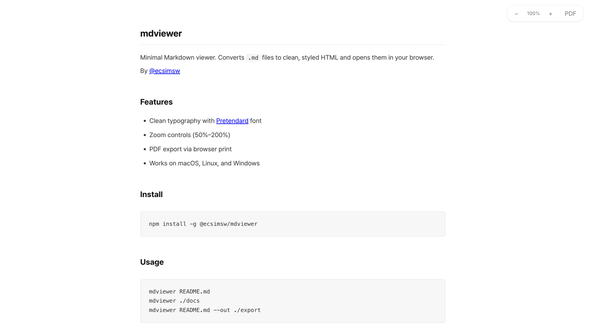

# mdviewer

Minimal Markdown viewer. Converts `.md` files to clean, styled HTML and opens them in your browser.

By [@ecsimsw](https://github.com/ecsimsw) | [Blog](https://ecsimsw.tistory.com/)



## Features

- Clean typography with [Pretendard](https://github.com/orioncactus/pretendard) font
- Zoom controls (50%–200%)
- PDF export via browser print
- Works on macOS, Linux, and Windows

## Install

```bash
npm install -g @ecsimsw/mdviewer
```

## Usage

```bash
mdviewer README.md
mdviewer ./docs
mdviewer README.md --out ./export
```

Or without installing:

```bash
npx @ecsimsw/mdviewer README.md
```

## How it works

Converts Markdown to a styled HTML file in a temporary directory and opens it in your browser. The temp file is automatically deleted after 1 minute — do not refresh the page after that.

Use `--out` to save the HTML file permanently.

## macOS: Double-click to open

Run the install script to create a macOS app and set it as the default viewer for `.md` files:

```bash
git clone https://github.com/ecsimsw/mdviewer.git
cd mdviewer
./install.sh
```

After installation, double-click any `.md` file to open it with MarkdownViewer.

## License

MIT
