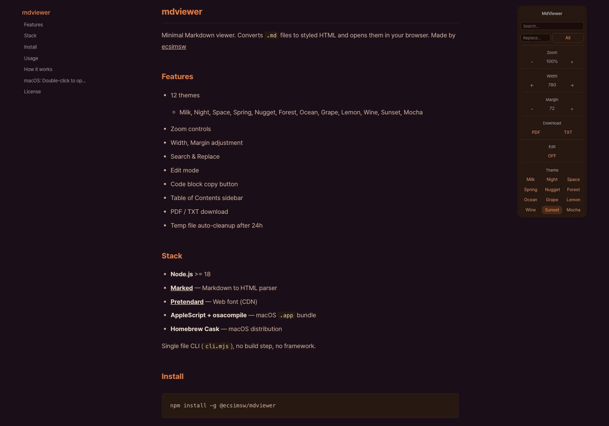

# mdviewer

Minimal Markdown viewer. Converts `.md` files to styled HTML and opens them in your browser.
Made by [ecsimsw](https://github.com/ecsimsw)

## Features

- 12 themes 
  - Milk, Night, Space, Spring, Nugget, Forest, Ocean, Grape, Lemon, Wine, Sunset, Mocha
- Zoom controls
- Width, Margin adjustment
- Search & Replace
- Edit mode
- Code block copy button
- Table of Contents sidebar
- PDF / TXT download
- Temp file auto-cleanup after 24h

## Stack

- **Node.js** >= 18
- **[Marked](https://github.com/markedjs/marked)** — Markdown to HTML parser
- **[Pretendard](https://github.com/orioncactus/pretendard)** — Web font (CDN)
- **AppleScript + osacompile** — macOS `.app` bundle
- **Homebrew Cask** — macOS distribution

Single file CLI (`cli.mjs`), no build step, no framework.

## Install

```bash
npm install -g @ecsimsw/mdviewer
```

## Usage

```bash
mdviewer README.md
mdviewer ./docs
mdviewer README.md --out ./export
```

Or without installing:

```bash
npx @ecsimsw/mdviewer README.md
```

## How it works

Converts Markdown to a styled HTML file in a temp directory and opens it in your browser. Old temp files are automatically cleaned up on next launch.

Use `--out` to save the HTML file permanently.

## macOS: Double-click to open

Install via Homebrew to get the macOS app:

```bash
brew tap ecsimsw/tap
brew install --cask mdviewer
```

After installation, double-click any `.md` file to open it with MarkdownViewer.

## Preview Milk


## Preview Sunset



## License

MIT
